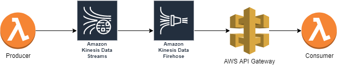

# Case1：AWS Kinesis Data Firehose with http endpoint

## Arhitecture



We use lambda function with api gateway trigger as http endpoint in this example.

## How to deploy

```bash
./deploy.sh http-destination
```

## How to test

1. invoke producer lambda with aws console or aws cli
2. check the consumer lambda log with aws console
